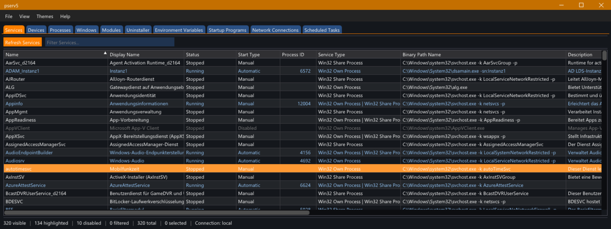

# pserv5 - Graphical User Interface

`pserv5.exe` is the graphical interface for pserv5. It provides a modern, tabbed interface for managing Windows system components.

## Overview

pserv5 features:
- **Tabbed interface** for quick switching between views
- **Real-time filtering** with instant search
- **Column sorting** by clicking headers
- **Context menus** for quick actions
- **Properties dialogs** for detailed information and editing
- **Remote machine support** for Services view
- **Auto-refresh** to keep data current
- **Export** to JSON, CSV, and clipboard

## Views

### Services

Manage Windows services:
- View all services with status, start type, and configuration
- Start, stop, restart, pause, and continue services
- Change startup type (Automatic, Manual, Disabled)
- View service dependencies
- Connect to remote machines to manage their services

### Devices

Browse hardware devices:
- View device tree by class
- See device status and driver information
- Enable/disable devices

### Processes

Monitor running processes:
- View all running processes with memory usage and CPU
- Terminate processes
- Change process priority
- Open file location

### Windows

Enumerate application windows:
- View all top-level windows
- See window class, handle, and owning process
- Show/hide windows
- Close windows

### Modules

Inspect loaded DLLs:
- View modules loaded in the selected process
- See module path and base address
- Open module file location

### Uninstaller

Browse installed programs:
- View all installed applications
- See publisher, version, and install date
- Launch uninstaller

### Environment Variables

Manage environment variables:
- View user and system variables
- Edit variable values
- Create new variables
- Delete variables

### Startup Programs

Manage startup applications:
- View programs that run at login
- Enable/disable startup entries
- Delete startup entries
- See registry location or startup folder path

### Network Connections

Monitor network activity:
- View active TCP and UDP connections
- See local and remote addresses
- Identify owning process

### Scheduled Tasks

View scheduled tasks:
- See all scheduled tasks
- View last run and next run times
- Run, enable, or disable tasks

## Keyboard Shortcuts

| Shortcut | Action |
|----------|--------|
| `Ctrl+1` through `Ctrl+0` | Switch to tab 1-10 |
| `F5` | Refresh current view |
| `Delete` | Delete selected item(s) |
| `Ctrl+Mouse Wheel` | Zoom font size |

## Menu Reference

### File Menu

- **Refresh** (F5) - Reload data for the current view
- **Connect to Local Machine** - Switch to local machine (Services)
- **Connect to Remote Machine** - Connect to a remote computer (Services)
- **Exit** (Alt+F4) - Close the application

### View Menu

Quick access to all views (with keyboard shortcuts).

### Themes Menu

- **Dark** - Dark color theme (default)
- **Light** - Light color theme

### Help Menu

- **Documentation** - Open online documentation
- **About** - Version and build information

## Configuration

Settings are stored in `%APPDATA%\pserv5\config.toml`:
- Window position and size
- Selected theme
- Column widths and order per view
- Auto-refresh settings
- Last connected remote machine

## Remote Machine Access

The Services view supports connecting to remote machines:

1. Go to **File > Connect to Remote Machine**
2. Enter the machine name or IP address
3. Click **Connect**

Requirements for remote access:
- Remote Registry service must be running on the target
- Appropriate administrative permissions
- Network connectivity to the target machine

## Command Line Companion

For scripting and automation, use `pservc.exe` - the command-line interface. See [pservc documentation](pservc.md) for details.
